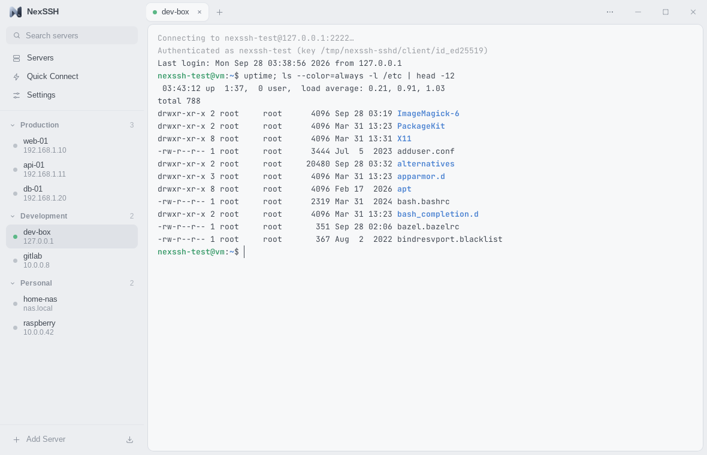
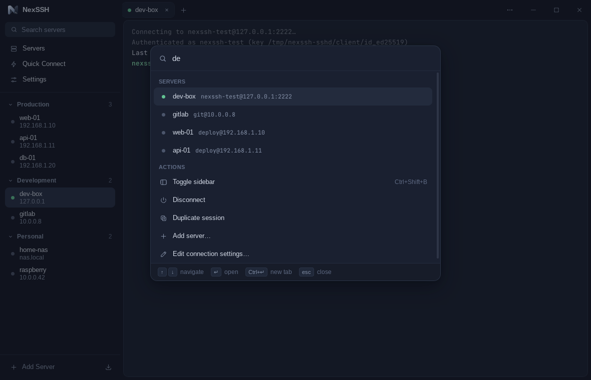
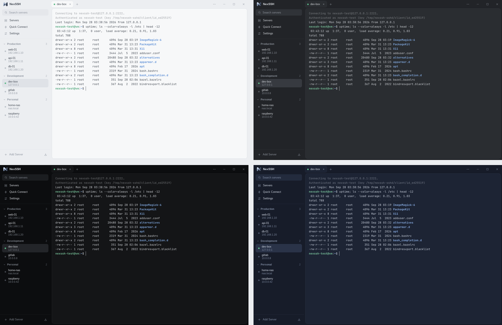

<p align="center">
  
</p>

<h1 align="center">NexSSH</h1>

<p align="center">
  A fast, minimal SSH client where the terminal comes first.<br>
  <a href="https://github.com/likDanil/NexSSH/releases/latest"><b>Download for Windows</b></a> ·
  <a href="README.ru.md">Русский</a> ·
  <a href="docs/ARCHITECTURE.md">Architecture</a>
</p>



## Why

* **Light.** A Rust core and the system webview (Tauri 2) instead of a bundled browser:
  a small installer, low memory use and practically no CPU while idle.
* **Calm.** Two areas only — servers and the terminal. Everything else lives in the
  command palette, menus and short dialogs.
* **Safe by default.** Passwords and passphrases are stored only in the OS keychain;
  host keys are verified OpenSSH-style.

## Features

* Saved servers with groups, search and live status; **import from `~/.ssh/config`**
  (`Include`, wildcard `Host` blocks, `ProxyJump`, forwards).
* Tabs with a real terminal (xterm.js, GPU rendering), resize, copy/paste, reconnect with <kbd>Enter</kbd>.
* Authentication: SSH agent (OpenSSH agent, Pageant, 1Password…), private keys (OpenSSH,
  PEM, PKCS#8, PuTTY `.ppk`) — the passphrase is asked only if the server accepts the key;
  pick a key from those found in `~/.ssh` or with *Browse…* — passwords and
  keyboard-interactive / 2FA.
* `known_hosts` support (hashed entries, wildcards) with a clear warning when a host key changes.
* Jump hosts (including chains): a saved server, or an address with its own login and
  password (kept in the keychain like the others); keepalive, connection timeouts, custom ports.
* Port forwarding: local (`-L`), remote (`-R`) and SOCKS5 (`-D`), optionally saved per server.
* **Local terminal** in the same tabs as SSH sessions: PowerShell, Command Prompt, WSL
  distributions, Git Bash — or any shell or command of your choice (*Settings → Terminal*).
  <kbd>Ctrl+Shift+&#96;</kbd>, the menu next to **+**, the sidebar or the palette; <kbd>Enter</kbd>
  starts it again after it exits. On Windows, **Open with NexSSH** in Explorer's menu for
  folders opens one right in that folder. On Windows 11 it can be in the compact menu itself,
  not only under *Show more options*: *Settings → Terminal → Move to the compact menu* (Windows
  asks for administrator rights once).
* **Files over SFTP** next to the terminal, on the same connection (no second login):
  upload files and whole folders (buttons, or drag & drop — onto a folder in the list to
  put them there), download into *Downloads* or any folder, several at once with
  <kbd>Ctrl</kbd>/<kbd>Shift</kbd>+click; rename, delete, create files and folders, change
  permissions (also recursively), sort by name, size or date, jump to a name by typing it,
  and *Open in terminal* to `cd` there. Transfers show speed and time left and can be
  cancelled; nothing is overwritten without asking.
* **In-app updates** (Windows): NexSSH finds a new release by itself; *Download* fetches it
  in the background and *Install* updates silently — no installer windows — and restarts.
  Updates are signed and verified before they run.
* Command palette and quick connect: <kbd>Ctrl</kbd>/<kbd>⌘</kbd>+<kbd>K</kbd>, type `user@host:port`.
* Themes: Light, Graphite, Black, Navy — or follow the system.
* Languages: English and Russian (follows the system by default, switch in Settings or the palette).



## Themes



## Install

**Windows 10/11:** download `NexSSH_<version>_x64-setup.exe` from
[Releases](https://github.com/likDanil/NexSSH/releases). It installs for the current user
(no admin rights) and installs the WebView2 runtime if it is missing. Builds are not code
signed yet, so SmartScreen may ask for confirmation (*More info → Run anyway*). Later
versions arrive through the app itself (*Settings → About*, or the card in the sidebar);
version 0.1.0 predates in-app updates, so install the next version over it once by hand.

**macOS / Linux:** build from source for now (see below).

## Keyboard shortcuts

| Action | Windows / Linux | macOS |
| --- | --- | --- |
| Command palette | <kbd>Ctrl+Shift+K</kbd> (<kbd>Ctrl+K</kbd> outside the terminal) | <kbd>⌘K</kbd> |
| New session / quick connect | <kbd>Ctrl+Shift+T</kbd> | <kbd>⌘T</kbd> |
| Local terminal | <kbd>Ctrl+Shift+&#96;</kbd> | <kbd>⌃⇧&#96;</kbd> |
| Close tab | <kbd>Ctrl+Shift+W</kbd> | <kbd>⌘W</kbd> |
| Next / previous tab | <kbd>Ctrl+Tab</kbd> / <kbd>Ctrl+Shift+Tab</kbd> | <kbd>⌘⇧]</kbd> / <kbd>⌘⇧[</kbd> |
| Go to tab 1–9 | <kbd>Ctrl+1…9</kbd> | <kbd>⌘1…9</kbd> |
| Reconnect | <kbd>Enter</kbd> in a closed session, <kbd>Ctrl+Shift+R</kbd> | <kbd>Enter</kbd>, <kbd>⌘R</kbd> |
| Copy / paste | <kbd>Ctrl+Shift+C</kbd> / <kbd>Ctrl+Shift+V</kbd> (<kbd>Ctrl+C</kbd> copies a selection) | <kbd>⌘C</kbd> / <kbd>⌘V</kbd> |
| Toggle sidebar | <kbd>Ctrl+Shift+B</kbd> | <kbd>⌘B</kbd> |
| Files (SFTP) | <kbd>Ctrl+Shift+E</kbd> | <kbd>⌘⇧E</kbd> |
| Full screen | <kbd>F11</kbd> | <kbd>⌃⌘F</kbd> |
| Settings | <kbd>Ctrl+,</kbd> | <kbd>⌘,</kbd> |

On Windows and Linux plain <kbd>Ctrl+K</kbd>, <kbd>Ctrl+W</kbd>, <kbd>Ctrl+R</kbd> and <kbd>Ctrl+B</kbd>
are left to the shell (kill line, delete word, history search, tmux). A setting lets
<kbd>Ctrl+K</kbd> open the palette inside the terminal too. Shortcuts work with any keyboard
layout: with a Cyrillic one, <kbd>Ctrl+Shift+K</kbd> is the same key as on a US keyboard.

## Build from source

Requirements: [Rust](https://rustup.rs) 1.89+, Node.js 20.19+ (or 22.12+), and the
[Tauri prerequisites](https://v2.tauri.app/start/prerequisites/) for your OS
(Linux: `libwebkit2gtk-4.1-dev libgtk-3-dev librsvg2-dev libdbus-1-dev`).

```sh
npm install
npm run dev     # run the app with hot reload
npm run build   # optimized build + installer for the current OS
```

On Windows, *Open with NexSSH* gets into Windows 11's compact menu only with the package
built by `scripts/explorer-package.ps1` (needs the Windows SDK) embedded; without it the entry
is under *Show more options*:

```powershell
pwsh scripts/explorer-package.ps1
$env:NEXSSH_EXPLORER_PACKAGE = "$PWD\target\explorer-package"
npm run build
```

## Development

```
core/      SSH, authentication, known_hosts, forwarding, storage (no GUI dependencies)
desktop/   Tauri shell: window, IPC commands, settings
explorer/  Windows 11's Explorer menu entry: its COM server and package
ui/        Svelte 5 + TypeScript + xterm.js
```

See [docs/ARCHITECTURE.md](docs/ARCHITECTURE.md) for how the pieces fit together.

Checks (the same as CI):

```sh
npm run check                                        # svelte-check
cargo fmt --all --check
cargo clippy --workspace --all-targets -- -D warnings
cargo test --workspace
```

The integration tests connect to real OpenSSH servers. On Linux they can be started with:

```sh
sudo scripts/test-sshd.sh                  # 127.0.0.1:2222 (password/keys), :2223 (keyboard-interactive)
eval "$(sudo scripts/test-sshd.sh env)"
cargo test -p nexssh-core --test sshd --test sftp
```

Useful environment variables:

| Variable | Effect |
| --- | --- |
| `NEXSSH_DATA_DIR` | Use another data folder (portable setups, testing). |
| `NEXSSH_LOG` | Log level: `error`, `warn`, `info`, `debug`, `trace`. |
| `NEXSSH_UI_OS` | Preview another platform's window chrome (`windows`, `macos`, `linux`). |
| `NEXSSH_UPDATE_URL` | Read updates from another `latest.json` (testing; `http://` only in debug builds). |

`NexSSH --cwd <folder>` opens a local terminal in that folder (in the running window, if
NexSSH is already open); it is what *Open with NexSSH* in Explorer runs.

**Data folder:** `%APPDATA%\NexSSH` (Windows), `~/Library/Application Support/NexSSH` (macOS),
`~/.config/nexssh` (Linux). It holds `servers.json`, `settings.json` and `known_hosts` —
never secrets.

## Releasing

Releases are built by GitHub Actions ([release.yml](.github/workflows/release.yml)):

* push a tag — `git tag v0.2.0 && git push origin v0.2.0`, or
* **Actions → Release → Run workflow**: enter a version, or leave it empty to release the
  version in `Cargo.toml` if it is newer than the latest release (raise it there for a new
  minor or major version), otherwise the next patch version. *Dry run* builds the installer
  without publishing.

The workflow writes the version into `Cargo.toml`, builds the NSIS installer on Windows and
publishes a GitHub release with `NexSSH_<version>_x64-setup.exe` and `SHA256SUMS.txt`.
Branch pushes that change the release setup (the workflow, `tauri.conf.json`, icons, the
installer hooks, the Explorer menu's package) run it as a dry run: the installer is built and
attached to the workflow run, nothing is published.

**In-app updates** need the updater signing key as repository secrets
(*Settings → Secrets and variables → Actions*):

| Secret | Value |
| --- | --- |
| `TAURI_SIGNING_PRIVATE_KEY` | the private key (contents of the `.key` file) |
| `TAURI_SIGNING_PRIVATE_KEY_PASSWORD` | its password |

With them the installer is signed and the release gets a `latest.json`, which installed apps
read from `releases/latest/download/latest.json`. The matching public key is
`plugins.updater.pubkey` in [tauri.conf.json](desktop/tauri.conf.json); a new key pair
(`npm run tauri signer generate`) needs a new public key there, and apps built with the old
key will not accept updates signed with the new one. Without the secrets a release stops
right away (installed apps could not see it); dry runs still build, unsigned.

**Windows 11's Explorer menu entry** comes in a package signed with NexSSH's own certificate,
which computers trust once (the user allows it with administrator rights), so it stays the same
from release to release:

| Secret | Value |
| --- | --- |
| `EXPLORER_SIGNING_CERT` | the certificate with its private key: a PFX file, base64 |
| `EXPLORER_SIGNING_PASSWORD` | the PFX file's password |

Its subject has to be `CN=NexSSH` (the package's publisher), with the code signing usage. A
release stops without them; dry runs and development builds sign with a certificate of their
own.

## Roadmap

* Split terminals
* Snippets and command history
* macOS and Linux installers, code signing
* Settings sync

## License

[MIT](LICENSE)
