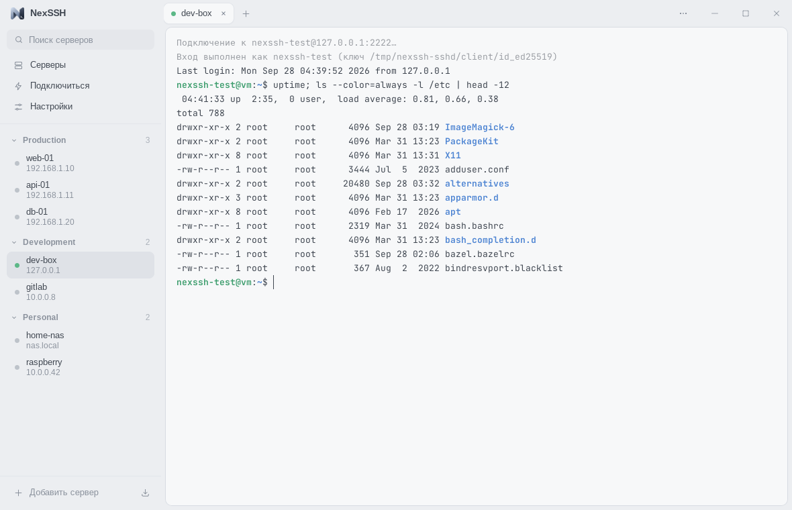

<p align="center">
  
</p>

<h1 align="center">NexSSH</h1>

<p align="center">
  Быстрый минималистичный SSH-клиент, в котором главное — терминал.<br>
  <a href="https://github.com/likDanil/NexSSH/releases/latest"><b>Скачать для Windows</b></a> ·
  <a href="README.md">English</a> ·
  <a href="docs/ARCHITECTURE.md">Архитектура</a>
</p>



## Зачем

* **Лёгкий.** Ядро на Rust и системный webview (Tauri 2) вместо встроенного браузера:
  маленький установщик, мало памяти, почти нулевая нагрузка на CPU в простое.
* **Спокойный интерфейс.** Только две области — серверы и терминал. Всё остальное —
  в командной палитре, меню и коротких диалогах.
* **Безопасный по умолчанию.** Пароли и passphrase хранятся только в системном хранилище
  (Windows Credential Manager, macOS Keychain, Secret Service); ключи хостов проверяются
  как в OpenSSH.

## Возможности

* Серверы с группами, поиском и статусом подключения; **импорт `~/.ssh/config`**
  (`Include`, шаблоны `Host`, `ProxyJump`, пробросы портов).
* Вкладки с настоящим терминалом (xterm.js, GPU-рендеринг), resize, копирование/вставка,
  переподключение клавишей <kbd>Enter</kbd>. Веб-ссылки в выводе открываются по
  <kbd>Ctrl</kbd>+клику (<kbd>⌘</kbd>+клик в macOS), как и гиперссылки, которые выводят программы
  (OSC 8, например `ls --hyperlink`): у них сначала видно, куда они ведут. Меню правого клика
  по ссылке открывает или копирует её. Перед вставкой нескольких строк NexSSH показывает их и
  спрашивает, если программа не принимает вставку как текст (bracketed paste); управляющие
  символы во вставку не попадают.
* Аутентификация: SSH-агент (OpenSSH agent, Pageant, 1Password…), ключи (OpenSSH, PEM,
  PKCS#8, PuTTY `.ppk`) — passphrase спрашивается, только если сервер принимает ключ;
  ключ выбирается из найденных в `~/.ssh` или кнопкой *Обзор…* — пароль и
  keyboard-interactive / 2FA. Если у сервера не указан пользователь, NexSSH спросит имя при
  подключении (как *login as:* в PuTTY) и может его запомнить.
* `known_hosts` (хэшированные записи, шаблоны) и понятное предупреждение при смене ключа хоста.
* Jump-хосты (в том числе цепочки): сохранённый сервер или адрес со своим логином и паролем
  (пароль — в системном хранилище, как и остальные); keepalive, таймауты подключения,
  нестандартные порты.
* Проброс портов: локальный (`-L`), удалённый (`-R`) и SOCKS5 (`-D`), с сохранением для сервера.
* **Локальный терминал** в тех же вкладках, что и SSH-сеансы: PowerShell, командная строка,
  дистрибутивы WSL, Git Bash — или любая своя оболочка или команда (*Настройки → Терминал*).
  <kbd>Ctrl+Shift+&#96;</kbd>, меню рядом с **+**, сайдбар или палитра; после выхода
  <kbd>Enter</kbd> запускает его снова. В Windows пункт **«Открыть через NexSSH»** в меню папок
  Проводника открывает терминал прямо в этой папке; его добавляет установщик. В Windows 11 он
  сразу в основном меню, а не только в «Показать дополнительные параметры»: при установке Windows
  один раз попросит права администратора (если отказаться, *Настройки → Терминал → Перенести в
  основное меню* спросит снова), а обновления его сохраняют.
* **Файлы по SFTP** рядом с терминалом, в том же подключении (без повторного входа):
  загрузка файлов и целых папок (кнопками или перетаскиванием — в том числе прямо на папку
  в списке), скачивание в «Загрузки» или в любую папку, сразу нескольких через
  <kbd>Ctrl</kbd>/<kbd>Shift</kbd>+клик; переименование, удаление, новые файлы и папки,
  права доступа (в том числе рекурсивно), сортировка по имени, размеру и дате, переход к
  файлу по первым буквам и «Открыть в терминале» (`cd` в папку). У передач видны скорость и
  оставшееся время, их можно отменить; без вопроса ничего не перезаписывается.
* **ИИ-агенты (MCP):** Claude Code, Codex, Cursor и другие агенты выполняют команды, читают и
  пишут файлы, переносят файлы и папки на серверах, которые вы им открыли, — через ваши же
  сеансы. Для каждого сервера задаётся, что агентам можно: ничего (по умолчанию), спрашивать
  вас или всё; *Настройки → ИИ-агенты* показывают, что они делали. См. [ИИ-агенты](#ии-агенты).
* **Обновление из приложения** (Windows): NexSSH сам находит новый релиз; *Скачать* загружает
  его в фоне, *Установить* обновляет тихо — без окон установщика — и перезапускает программу.
  Обновления подписаны и проверяются перед запуском.
* Командная палитра и быстрое подключение: <kbd>Ctrl</kbd>/<kbd>⌘</kbd>+<kbd>K</kbd>, ввод `user@host:port`.
* Темы: светлая, серая, чёрная, синяя или как в системе.
* Языки: русский и английский (по умолчанию — как в системе; переключаются в настройках или в палитре).


## Темы


## Установка

**Windows 10/11:** скачайте `NexSSH_<версия>_x64-setup.exe` на странице
[Releases](https://github.com/likDanil/NexSSH/releases). Установка идёт для текущего
пользователя (без прав администратора); при необходимости установщик сам поставит WebView2.
Сборки пока не подписаны, поэтому SmartScreen может попросить подтверждение
(*Подробнее → Выполнить в любом случае*). Следующие версии приходят через само приложение
(*Настройки → О программе* или карточка в сайдбаре); в версии 0.1.0 обновления из приложения
ещё не было, поэтому следующую версию поверх неё нужно один раз поставить вручную.

**macOS / Linux:** пока — сборка из исходников (см. ниже).

## Горячие клавиши

| Действие | Windows / Linux | macOS |
| --- | --- | --- |
| Командная палитра | <kbd>Ctrl+Shift+K</kbd> (<kbd>Ctrl+K</kbd> вне терминала) | <kbd>⌘K</kbd> |
| Новая сессия / быстрое подключение | <kbd>Ctrl+Shift+T</kbd> | <kbd>⌘T</kbd> |
| Локальный терминал | <kbd>Ctrl+Shift+&#96;</kbd> (<kbd>Ctrl+Shift+Ё</kbd>) | <kbd>⌃⇧&#96;</kbd> |
| Закрыть вкладку | <kbd>Ctrl+Shift+W</kbd> | <kbd>⌘W</kbd> |
| Следующая / предыдущая вкладка | <kbd>Ctrl+Tab</kbd> / <kbd>Ctrl+Shift+Tab</kbd> | <kbd>⌘⇧]</kbd> / <kbd>⌘⇧[</kbd> |
| Вкладка 1–9 | <kbd>Ctrl+1…9</kbd> | <kbd>⌘1…9</kbd> |
| Переподключиться | <kbd>Enter</kbd> в закрытой сессии, <kbd>Ctrl+Shift+R</kbd> | <kbd>Enter</kbd>, <kbd>⌘R</kbd> |
| Копировать / вставить | <kbd>Ctrl+Shift+C</kbd> / <kbd>Ctrl+Shift+V</kbd> (<kbd>Ctrl+C</kbd> копирует выделение) | <kbd>⌘C</kbd> / <kbd>⌘V</kbd> |
| Открыть ссылку в терминале | <kbd>Ctrl</kbd>+клик | <kbd>⌘</kbd>+клик |
| Шрифт терминала: крупнее / мельче / обычный | <kbd>Ctrl+=</kbd> / <kbd>Ctrl+-</kbd> / <kbd>Ctrl+0</kbd>, <kbd>Ctrl</kbd>+колесо | <kbd>⌘=</kbd> / <kbd>⌘-</kbd> / <kbd>⌘0</kbd>, щипок |
| Скрыть/показать сайдбар | <kbd>Ctrl+Shift+B</kbd> | <kbd>⌘B</kbd> |
| Файлы (SFTP) | <kbd>Ctrl+Shift+E</kbd> | <kbd>⌘⇧E</kbd> |
| Полный экран | <kbd>F11</kbd> | <kbd>⌃⌘F</kbd> |
| Настройки | <kbd>Ctrl+,</kbd> | <kbd>⌘,</kbd> |

В Windows и Linux обычные <kbd>Ctrl+K</kbd>, <kbd>Ctrl+W</kbd>, <kbd>Ctrl+R</kbd> и <kbd>Ctrl+B</kbd>
остаются за shell (удалить до конца строки / вырезать в nano, удалить слово, поиск по
истории, префикс tmux). В настройках можно разрешить <kbd>Ctrl+K</kbd> открывать палитру и
внутри терминала. Сочетания работают в любой раскладке: в русской <kbd>Ctrl+Shift+K</kbd> — это
<kbd>Ctrl+Shift+Л</kbd>, та же клавиша.

## ИИ-агенты

NexSSH — MCP-сервер ([Model Context Protocol](https://modelcontextprotocol.io)) для
ИИ-агентов. Включите его в *Настройки → ИИ-агенты* и откройте агентам серверы: изменить сервер
→ *Дополнительно* → *ИИ-агенты*:

* **Нет доступа** (по умолчанию): агенты не видят сервер.
* **Спрашивать**: агенты могут смотреть папки и читать файлы, а каждая команда, запись файла и
  загрузка ждут, пока вы нажмёте *Выполнить* или *Разрешить* в NexSSH. Можно разрешить агенту
  больше не спрашивать про этот сервер, пока NexSSH открыт.
* **Полный доступ**: агенты работают без вопросов.

Чтобы подключить агента, скопируйте то, что для него показывают *Настройки → ИИ-агенты*
(Claude Code, Codex, блок JSON для Claude Desktop, Cursor, Windsurf и других или HTTP). Для
Claude Code это одна команда с путём к NexSSH на вашем компьютере:

```sh
claude mcp add --scope user nexssh "C:\Users\you\AppData\Local\NexSSH\NexSSH.exe" mcp
```

`NexSSH mcp` — мост через стандартные ввод и вывод: токен он берёт из системного хранилища
паролей, поэтому в настройках агента нет секретов, а если NexSSH не запущен, первый же вызов
инструмента его запустит. Агенты, которые подключаются по адресу, используют
`http://127.0.0.1:7422/mcp` с токеном из настроек (`Authorization: Bearer …`); подключиться
можно только с этого компьютера.

Инструменты: `list_servers`, `run_command` (код выхода, stdout и stderr; без терминала),
`read_file`, `write_file`, `list_directory`, а также `upload` и `download` для файлов и целых
папок на полной скорости SFTP. Они работают в ваших сеансах: команда идёт по отдельному каналу
того же подключения, что и вкладка, поэтому повторный вход не нужен и ваш ввод в терминале она
не трогает. Для неподключённого сервера открывается вкладка — за вашей, а вперёд она выходит,
когда нужен пароль или код 2FA. На вкладке, где работает агент, виден значок ✦.

## Сборка из исходников

Нужны [Rust](https://rustup.rs) 1.89+, Node.js 20.19+ (или 22.12+) и
[зависимости Tauri](https://v2.tauri.app/start/prerequisites/) для вашей ОС
(Linux: `libwebkit2gtk-4.1-dev libgtk-3-dev librsvg2-dev libdbus-1-dev`).

```sh
npm install
npm run dev     # приложение с горячей перезагрузкой
npm run build   # оптимизированная сборка + установщик для текущей ОС
```

В Windows пункт «Открыть через NexSSH» попадает в основное меню Windows 11, только если в
сборку встроен пакет из `scripts/explorer-package.ps1` (нужен Windows SDK); без него пункт
будет в «Показать дополнительные параметры»:

```powershell
pwsh scripts/explorer-package.ps1
$env:NEXSSH_EXPLORER_PACKAGE = "$PWD\target\explorer-package"
npm run build
```

## Разработка

```
core/      SSH, аутентификация, known_hosts, проброс портов, хранилище (без GUI-зависимостей)
desktop/   оболочка Tauri: окно, IPC-команды, настройки
explorer/  пункт в меню Проводника Windows 11: его COM-сервер и пакет
ui/        Svelte 5 + TypeScript + xterm.js
```

Подробно — в [docs/ARCHITECTURE.md](docs/ARCHITECTURE.md).

Проверки (те же, что в CI):

```sh
npm run check
cargo fmt --all --check
cargo clippy --workspace --all-targets -- -D warnings
cargo test --workspace
```

Интеграционные тесты подключаются к настоящему OpenSSH. В Linux серверы запускаются так:

```sh
sudo scripts/test-sshd.sh
eval "$(sudo scripts/test-sshd.sh env)"
cargo test -p nexssh-core --test sshd --test sftp
```

Тестам передачи файлов в `sftp_local` сервер не нужен: он работает в самом тесте, за прокси,
который добавляет задержку. Они же замеряют скорость и поднимают «медленный канал», чтобы
проверить на нём приложение:

```sh
NEXSSH_BENCH_DELAY_MS=25 cargo test --release -p nexssh-core --test sftp_local transfer_speed -- --ignored --nocapture
cargo test -p nexssh-core --test sftp_local serve -- --ignored --nocapture
```

Переменные окружения: `NEXSSH_DATA_DIR` — другая папка данных (портативный режим, тесты),
`NEXSSH_LOG` — уровень логов, `NEXSSH_UI_OS` — предпросмотр заголовка окна другой ОС,
`NEXSSH_UPDATE_URL` — брать обновления из другого `latest.json` (для тестов; `http://` —
только в debug-сборках).

`NexSSH --cwd <папка>` открывает локальный терминал в этой папке (в уже открытом окне, если
NexSSH запущен) — это и выполняет «Открыть через NexSSH» в Проводнике.

**Папка данных:** `%APPDATA%\NexSSH` (Windows), `~/Library/Application Support/NexSSH` (macOS),
`~/.config/nexssh` (Linux). Там лежат `servers.json`, `settings.json` и `known_hosts` —
секретов там нет никогда.

## Релизы

Релизы собирает GitHub Actions ([release.yml](.github/workflows/release.yml)):

* запушить тег — `git tag v0.2.0 && git push origin v0.2.0`, или
* **Actions → Release → Run workflow**: указать версию или оставить поле пустым — тогда
  выйдет версия из `Cargo.toml`, если она новее последнего релиза (её поднимают там для новой
  минорной или мажорной версии), иначе следующая патч-версия. *Dry run* собирает установщик
  без публикации.

Workflow подставляет версию в `Cargo.toml`, собирает NSIS-установщик на Windows и публикует
релиз с `NexSSH_<версия>_x64-setup.exe` и `SHA256SUMS.txt`.
Пуши в ветки, которые меняют настройки релиза (workflow, `tauri.conf.json`, иконки, хуки
установщика, пакет пункта меню Проводника), запускают его в режиме dry run: установщик
собирается и прикрепляется к запуску workflow, но не публикуется.

**Обновлениям из приложения** нужен ключ подписи в секретах репозитория
(*Settings → Secrets and variables → Actions*):

| Секрет | Значение |
| --- | --- |
| `TAURI_SIGNING_PRIVATE_KEY` | приватный ключ (содержимое файла `.key`) |
| `TAURI_SIGNING_PRIVATE_KEY_PASSWORD` | его пароль |

С ними установщик подписывается, а к релизу добавляется `latest.json`, который установленные
приложения читают по адресу `releases/latest/download/latest.json`. Парный публичный ключ —
`plugins.updater.pubkey` в [tauri.conf.json](desktop/tauri.conf.json); для новой пары ключей
(`npm run tauri signer generate`) там нужен новый публичный ключ, а приложения со старым ключом
не примут обновления, подписанные новым. Без секретов релиз сразу останавливается (установленные
программы его бы не увидели); dry run собирается и без них, но без подписи.

**Пункт в меню Проводника Windows 11** устанавливается пакетом, подписанным собственным
сертификатом NexSSH. Компьютер доверяет ему один раз (пользователь разрешает это с правами
администратора), поэтому сертификат не должен меняться от релиза к релизу:

| Секрет | Значение |
| --- | --- |
| `EXPLORER_SIGNING_CERT` | сертификат с закрытым ключом: файл PFX в base64 |
| `EXPLORER_SIGNING_PASSWORD` | пароль файла PFX |

Субъект сертификата — `CN=NexSSH` (издатель пакета), назначение — подпись кода. Без этих
секретов релиз останавливается; dry run и сборки для разработки подписывают пакет своим
сертификатом.

## Планы

* Разделение терминала (split)
* Сниппеты и история команд
* Установщики для macOS и Linux, подпись кода
* Синхронизация настроек

## Лицензия

[MIT](LICENSE)
